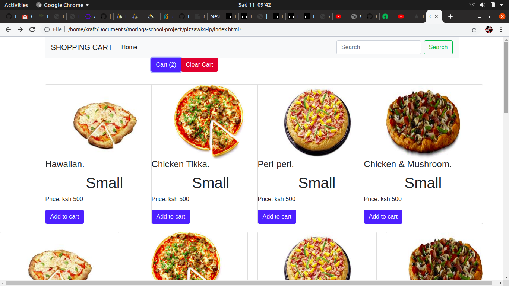

# pizzawk4-ip
# Description 
For this project, I created an interactive pizza ordering menu using JavaScript. jQuery, HTML and CSS The application allows the user to select from multiple different pizza options, including: size, crust, topping. There is a scrol down list for the  user to select one option each for size, crust, topping, and cheese, and checks out to the cart. particular options will add additional cost to the order. When the user is finished with creating their order, they click the chart button, which brings up an order recipt with the itemized cost of their various selections and a grand total. and allow them to give their location for delivery.

#### [! Image description](link-to-image) 

## Dependencies
 * Bootstrap.js
    -Version: 3.3.4
    -Download
    -Website
 * JQuery
    -Version: 1.11.2
    -Download: Unneeded, it is downloaded in-line.
    -Website
### Setup
You need to download the project either using Git pull or download a snapshot of the Master branch of this repo.
Snapshot
After you've downloaded, place /website/ in the web folder for your PHP enabled Webserver

## GitHub link
* live link: [https://github.com/Kraft-Owaka/pizzawk4-ip/settings]

## Dependency Setup
NOTE: Do not include the root folder, only the contents of the root folder.

    * Bootstrap.js
    Install Directory: /website/bootstrap/
    Copy contents of the bootstrap-VERSION-dist folder into the Install Directory.
    Files copied should include
    /css/
    /fonts/
    /js/

## Setup Complete
    Hopefully the setup process the went well and it all you now have a working website!
# Known Bugs
 - On checkout the website only allows for location delivery and not the option of individual pick-up.
 - on cart after selection of the chiken tikka on click of the + button it ads a new undefined item "chicken" to the list. in an event you get the NAN order show up on checkout cancel the spesific order and continue.

# Technologies Used
    - HTML
    - CSS
    - jQuery
    - javaScript
    - Bootstrap

## Licence

Copyright <2019> <COPYRIGHT Owaka Kraft>

Permission is hereby granted, free of charge, to any person obtaining a copy of this software and associated documentation files (the "Software"), to deal in the Software without restriction, including without limitation the rights to use, copy, modify, merge, publish, distribute, sublicense, and/or sell copies of the Software, and to permit persons to whom the Software is furnished to do so, subject to the following conditions:

The above copyright notice and this permission notice shall be included in all copies or substantial portions of the Software.

THE SOFTWARE IS PROVIDED "AS IS", WITHOUT WARRANTY OF ANY KIND, EXPRESS OR IMPLIED, INCLUDING BUT NOT LIMITED TO THE WARRANTIES OF MERCHANTABILITY, FITNESS FOR A PARTICULAR PURPOSE AND NONINFRINGEMENT. IN NO EVENT SHALL THE AUTHORS OR COPYRIGHT HOLDERS BE LIABLE FOR ANY CLAIM, DAMAGES OR OTHER LIABILITY, WHETHER IN AN ACTION OF CONTRACT, TORT OR OTHERWISE, ARISING FROM, OUT OF OR IN CONNECTION WITH THE SOFTWARE OR THE USE OR OTHER DEALINGS IN THE SOFTWARE.